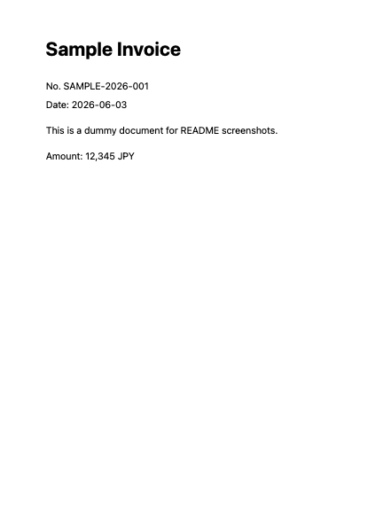
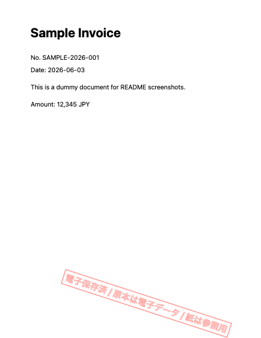

# Print With Stamp

PDF にスタンプを付加し、必要な場合だけ macOS の `lp` コマンドで印刷する小さな CLI ツールです。

「極秘」などのよくあるスタンプを付けることはもちろん、電子保存済みの書類を業務上印刷するときに、紙が原本ではなく参照用であることを示すスタンプを付けてから印刷できます。

## Features

- PDF の全ページ、1ページ目、または指定ページだけにスタンプを付加
- スタンプ文字、位置、サイズ、透明度、回転角度、余白を指定
- スタンプ済み PDF の保存だけ、または印刷まで実行
- macOS の `lp` にプリンタ名や印刷オプションを渡せる
- 白黒、カラー、片面、両面印刷のショートカットを用意
- プリンタ固有の `lp -o` オプションも指定可能

## Requirements

- macOS
- Swift 5.9 以降
- `lp` コマンド

`lp` は通常 macOS に含まれています。デフォルトプリンタが未設定の場合は `--printer` でプリンタ名を指定してください。

## Build

```sh
swift build
```

## Install

日常的に使う場合は、release ビルドした実行ファイルを `PATH` の通った場所へコピーします。

```sh
swift build -c release
mkdir -p ~/bin
cp .build/release/print-with-stamp ~/bin/
```

`~/bin` に `PATH` が通っていない場合は、使っているシェルの設定に追加してください。zsh の場合:

```sh
echo 'export PATH="$HOME/bin:$PATH"' >> ~/.zshrc
source ~/.zshrc
```

インストール後は `swift run` なしで実行できます。

```sh
print-with-stamp input.pdf --stamp "CONFIDENTIAL" --output stamped.pdf
```

システム全体で使いたい場合は、管理者権限で `/usr/local/bin` などへコピーします。

```sh
sudo cp .build/release/print-with-stamp /usr/local/bin/
```

## Usage

スタンプ済み PDF を保存する:

```sh
swift run print-with-stamp input.pdf \
  --stamp "CONFIDENTIAL" \
  --stamp-size 52 \
  --output stamped.pdf
```

電子保存済み書類の参照用印刷に使う:

```sh
swift run print-with-stamp input.pdf \
  --stamp "電子保存済 / 原本は電子データ / 紙は参照用" \
  --position bottom-right \
  --output stamped.pdf
```

対象ページを指定する:

```sh
swift run print-with-stamp input.pdf \
  --stamp "CONFIDENTIAL" \
  --pages 1,3,5-7 \
  --output stamped.pdf
```

印刷する:

```sh
swift run print-with-stamp input.pdf \
  --stamp "CONFIDENTIAL" \
  --print
```

プリンタを指定して印刷する:

```sh
swift run print-with-stamp input.pdf \
  --stamp "CONFIDENTIAL" \
  --print \
  --printer "Printer Name"
```

白黒・片面で印刷する:

```sh
swift run print-with-stamp input.pdf \
  --stamp "CONFIDENTIAL" \
  --print \
  --color monochrome \
  --sides one-sided
```

印刷せずにスタンプ済み PDF だけ確認する:

```sh
swift run print-with-stamp input.pdf \
  --stamp "CONFIDENTIAL" \
  --output stamped.pdf \
  --dry-run
```

## Stamp Example

| Before | After |
| --- | --- |
|  |  |

## Options

- `--stamp TEXT`: スタンプ文字列。デフォルトは `STAMP`
- `--print`: スタンプ済み PDF を `lp` に渡して印刷する
- `--printer NAME`: `lp -d` に渡すプリンタ名
- `--print-option OPTION`: `lp -o OPTION` として渡す印刷オプション。複数指定可
- `--color MODE`: `auto`, `color`, `monochrome`
- `--sides MODE`: `auto`, `one-sided`, `two-sided-long-edge`, `two-sided-short-edge`
- `--output PATH`: スタンプ済み PDF の保存先
- `--position NAME`: `center`, `top-left`, `top-right`, `bottom-left`, `bottom-right`
- `--pages PAGES`: 対象ページ。`all`, `first`, `1,3,5-7` 形式。未指定時は `all`
- `--stamp-size POINTS`: スタンプ文字のサイズ。未指定時はページサイズから自動計算
- `--opacity VALUE`: `0.0` から `1.0`
- `--rotation DEGREES`: スタンプの回転角度
- `--margin POINTS`: ページ端からの余白
- `--dry-run`: PDF を作るだけで印刷しない
- `--help`: ヘルプを表示

`--output` は保存先の指定です。印刷は `--print` を指定した場合だけ実行されます。

## Printer Options

プリンタが対応している詳細オプションは macOS のターミナルで確認できます。

```sh
lpoptions -p "Printer Name" -l
```

プリンタ固有の `lp` オプションを指定する場合は `--print-option` を使います。

```sh
swift run print-with-stamp input.pdf \
  --stamp "CONFIDENTIAL" \
  --print \
  --print-option media=A4 \
  --print-option fit-to-page
```

`--color monochrome` は `print-color-mode=monochrome` と `ColorModel=Gray` を `lp` に渡します。プリンタによっては別のキーが必要なため、その場合は `lpoptions -p "Printer Name" -l` の出力にある白黒指定を `--print-option` で渡してください。

例えば、`lpoptions -l` に次のような行が出る場合:

```text
ARCMode/Color Mode: *CMAuto CMColor CMBW
```

`ARCMode` がオプション名、`CMBW` が白黒指定なので、次のように指定します。

```sh
swift run print-with-stamp input.pdf \
  --stamp "CONFIDENTIAL" \
  --print \
  --print-option ARCMode=CMBW
```

`--color` や `--sides` は汎用的なショートカットで、`--print-option` はプリンタ固有の値を直接渡すための指定です。相反する指定を同時に渡すと、どちらが優先されるかはプリンタドライバ次第です。

例えば、次の指定は汎用オプションではカラー、プリンタ固有オプションでは白黒を指定しているため避けてください。

```sh
swift run print-with-stamp input.pdf \
  --stamp "CONFIDENTIAL" \
  --print \
  --color color \
  --print-option ARCMode=CMBW
```

プリンタ固有の設定が分かっている場合は、`--color` を省いて `--print-option` に寄せるのが安全です。

## Notes

- このツールは PDF にスタンプを重ねて印刷・保存するためのものです。
- 電子帳簿保存法などの保存要件を満たすことを保証するものではありません。
- 電子的に保存すべき書類を印刷する場合、紙を原本として扱わないような文言を使うことをおすすめします。

例:

```text
電子保存済 / 原本は電子データ / 紙は参照用
```

## License

MIT License. See [LICENSE](LICENSE).
